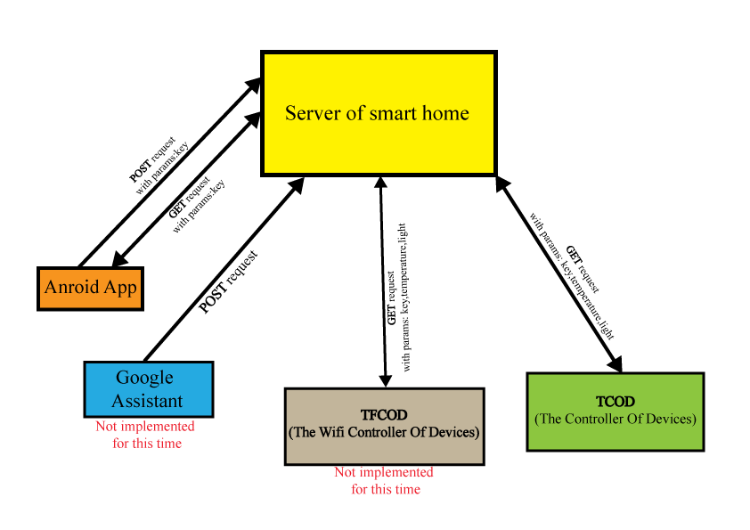

# The Project Smart Home
The project SmartHome is my project where I am implementing network for controlling home. 
This project includes: 
 * a server, which was created by Server TomCat ([ServerSmartHome](https://github.com/AlieksieievYurii/SmartHome_server));
 * The Controller Of Devices(TCOD)
 which is created by Arduino and Ethernet Shield ([TheControllerOfDevices](https://github.com/AlieksieievYurii/TheControllerOfDevices)).
 * Android App "SmartHome" ([Android-app-for-smart-home](https://github.com/AlieksieievYurii/Android-app-for-smart-home))
 
## Server:
&nbsp;

The work of server is simple. This server just get data(json file which contains data that
pins of Controller Devices need to  turn on) and send to TCOD. Server works by using servlets. 
Server has two serlvets, the first servlet "Actions" is used for controlling pins of TCOD. 
The second servlet is used for devices which send commands for SmartHome. 
TCOD does GET request to Servlet "Actions" every 500 miliseconds,then gets json file, 
doing parsing and turn on/off pin which is needed. Android App and other apps which can controll SmartHome, 
does POST request to Servlet "ActionsByDevices". This servlet reads data(json) from difference Apps(which can controll SmartHome) 
and just write it to file ActionsFromDevices.json. After that, ActionsFromDevices.json rewrite to file Actions.json(this json file is
for TCOD). Between ActionForm Device and Actions have to be Tasker(But it is not implemented at this moment)
which does some actions with data. For instance, install timer for turn on/off pin of TCOD.

## The Controller Of Devices(TCOD)

TCOD is microcontroller Arduino Mega with Ethernet Shield. The work of TCOD is simple. It does GET request to server 
and get json file from Servlet "Actions". The controller parses a json file and turn on/off pins by actions from this file.
TCOD does request every 500 miliseconds to server with params:key,temperature,light. The parameter key contains key access to server.
The parameter "temperature" contains value from Sensor(DHT11) of temperature.The parameter "light" contains value of light resistor.
The Light resistor shows luminosity inside room and outside.

## Android App "SmartHome"

The Android App "SmartHome" uses for controlling of smart home. The app does POST request to server. In the POST request contains
json object element. In this json file is number of pin and status HIGH/LOW or VALUE(if it is a PWM pin). After that, the app does
GET post every second for getting HashSum. HashSum is from json file ActionsByDevices. If after getting HashSum it differs from
HashSum in App, App will do GET request to server for getting json file actions of all pins.
The App contains dynamic user interface. Users can add dinamically Views(Buttons,SeekBars) and configurate it. For instance,
user wants to connect a lamp to pin 22. He has to connect it to 22 pin by relay. Next he has to add Button/SeekBar and configurate:
pin, id, icons, name in app. Also he can see example json object for TCOD. Users can remove or edit views.

 
 
 
 
 
(c) Yurii Alieksieiev 2018 Lodz,Poland
 

